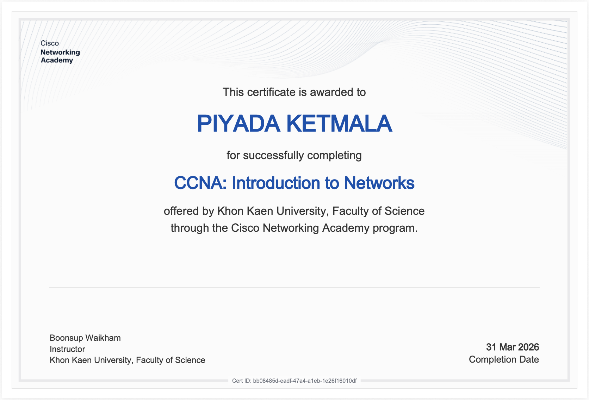
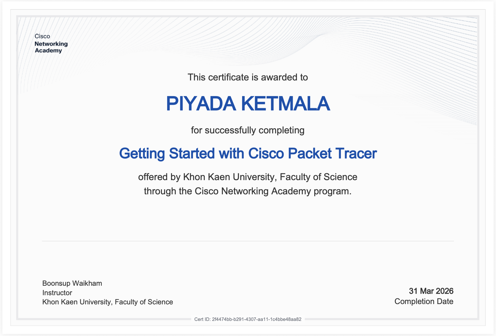

# Network-Portfolio

ชื่อ : นางสาวพิยดา เกษมาลา 
รหัสนักศึกษา : 673380052-5 
Section : 2 
Email : piyada.ke@kkumail.com

---

## 🖥️ Portfolio – Networks

This repository contains my assignments, labs, projects, and certificates related to Computer Networks and Network Programming.  

---

## 📄 Personal Assignment

| Assignment | Document Link |
|-----------|-------------|
| Essay | [View](https://docs.google.com/document/d/1-39_YHbI9JiT-8CinX5KXOZvBLZ4_k2YPCnI9h8hxrg/edit?usp=sharing) |
| Assignment 2 (Topology) | [View](https://docs.google.com/document/d/1-7K-nVBaNkjMdQBkKsCtf3JXqbWWZO79Eger39zE054/edit?usp=sharing)|
| Assignment 3 (Not Simple) | [View](https://drive.google.com/file/d/1PUrBnlwaCiw9lw3CGRALFMoLliA5oR7e/view?usp=share_link)|
| Assignment 4 (TCP-UDP) | [View](https://docs.google.com/document/d/13O0Kimx4ixeqp_3NAyYCB0l4FPN4YCe6wTmDuIsD5o8/edit?usp=sharing)|

---

## 👥 Group Activities (LAB1-5)

| LAB | Document Link |
|-----------|-------------|
| Lab 1 | [View](https://docs.google.com/document/d/1LTyeTCxfYjoqUJnsBHURvWGh1Y410z-8Ah7sDqklG1c/edit?usp=sharing)|
| Lab 2 | [View](https://docs.google.com/document/d/1BMCTrAFfA2mMvrydhwGSf1R466rwE9007YExsYK6FT8/edit?usp=sharing)|
| Lab 3 | [View](https://docs.google.com/document/d/1ay9XhTljggX9RlXcrCvseNOeFKb2ts6Vrp4NaN4QIF8/edit?usp=sharing)|
| Lab 4 | [View](https://docs.google.com/document/d/1MURDTx2FsTknknAwdjMUKIodGjyuBXNKRkQBv0g-u0M/edit?usp=sharing)|

---

## 🚀 Final Project

Drive : https://drive.google.com/drive/folders/1JaiOpJeRT33JaBn1Av1e7NAkkaVtYpW-  
Github : https://github.com/jrKitt/HapticNetwork  
NotebookLM : https://drive.google.com/file/d/1Jv6cPz3VDy1CSE2DuV496YV98Uiuj3_O/view  

---

## 🏆 Certificate

  

  

---

## 📚 Network Programming (Week 1–10)

Result Document Link : https://docs.google.com/document/d/1McxMJLTF2sXJMFXLY1bwJ_ta4t3thF7UuldaSRHaY28/edit?usp=sharing
